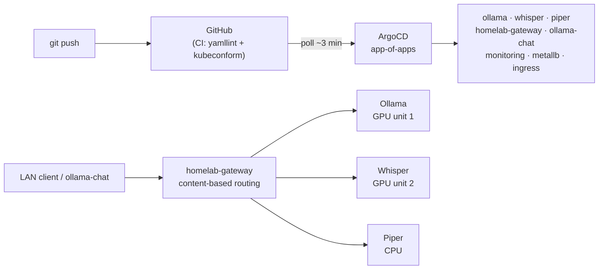

# gitops-homelab

[](https://github.com/koydas/gitops-homelab/actions/workflows/validate.yml)

**A self-hosted AI stack — chat, code, vision, speech-to-text, text-to-speech — on one 6 GB GTX 1060, deployed only through `git push`.**

Single-node bare-metal microk8s, ArgoCD app-of-apps, every manifest in this repo validated in CI (yamllint + kubeconform) before ArgoCD sees it. Built to be operated, not demoed: every decision is an ADR, every outage is in the runbook with its root cause.

| | |
|---|---|
| **One GPU, shared** | NVIDIA time-slicing splits the 1060 into 2 schedulable units: Ollama (`llama3.1:8b`, `qwen2.5-coder:7b`, `llava:7b`, all Q4_0) and Whisper STT. Piper TTS on CPU. |
| **Git is the only deploy path** | `root` app-of-apps auto-discovers `apps/`; five services are git-source Applications pointing at their own repos (`ollama-chat`, `homelab-gateway`, `piper`, `healing-simulator`, `jo-bines-adventures`). |
| **Decided in writing** | [25 ADRs](./docs/adr/README.md) — context, rejected alternatives, consequences |
| **Incidents, not hypotheticals** | [11 real incidents](./docs/runbook.md#incidents-hit-while-building-this) with symptom, root cause and fix, plus a symptom → cause lookup table |
| **Rebuildable** | Bare Ubuntu + NVIDIA driver → `install-host.sh` → one `kubectl apply`, plus 5 documented one-time steps ([below](#manual-post-install-steps)) |



Full component diagram: [docs/architecture.md](./docs/architecture.md).

## Fitting it in 6 GB

What it actually took, each step forced by a constraint or an incident:

| Decision | Why | ADR |
|---|---|---|
| Q4_0 only, no Q5_K_M for 7–8B models | Benchmarked: Q5_K_M ran **38 % slower** (16.5 vs 26.6 tok/s) — the Pascal card goes memory-bandwidth-bound — and its generated code failed the same tests as Q4, plus a missing method | [0011](./docs/adr/0011-ollama-q4-quantization.md) |
| Sequential requests, no `OLLAMA_NUM_PARALLEL` | Load-tested 1/2/5 concurrent requests against DCGM metrics: one slot avoids VRAM contention; queueing (2m26s for the 5th of 5) is acceptable for a single operator | [0013](./docs/adr/0013-ollama-sequential-requests.md) |
| Whisper on GPU via time-slicing (2 units), Ollama keep-alive 30 s | Two Deployments, one physical GPU | [0017](./docs/adr/0017-whisper-gpu-with-keep-alive.md) |
| `OLLAMA_MAX_LOADED_MODELS=1` | CUDA OOM on 2026-07-30: vision model loaded while the 8B text model was still resident, on top of Whisper's ~1.3 GB | [0019](./docs/adr/0019-ollama-max-loaded-models-one.md) |
| Fix `extraEnv` nesting | Same investigation found the keep-alive setting added the day before had **never reached the pod**: misplaced under `ollama.extraEnv`, Helm drops unknown keys without error, and the Deployment's `generation` was still `4` | [0019](./docs/adr/0019-ollama-max-loaded-models-one.md) |
| Whisper `strategy: Recreate` | A rolling update needs a third GPU unit that doesn't exist — the new pod waits forever for the old one's slot | [`apps/whisper/deployment.yaml`](./apps/whisper/deployment.yaml) |
| Root-disk auto-extend + Prometheus backstop alert | Model blobs and images fill the root LV | [0025](./docs/adr/0025-disk-space-auto-extend.md) |

## Documentation

- [docs/architecture.md](./docs/architecture.md) — components, what lives where, the GitOps sync mechanism
- [docs/request-flows.md](./docs/request-flows.md) — how a request reaches a pod (Ollama, homelab-gateway, voice mode)
- [docs/operations.md](./docs/operations.md) — GPU monitoring and ingress flows
- [docs/runbook.md](./docs/runbook.md) — operational tasks and troubleshooting (real incidents, not hypothetical)
- [docs/testing.md](./docs/testing.md) — verification checklist and the Postman collection
- [docs/adr/](./docs/adr/README.md) — Architecture Decision Records: what was decided, alternatives considered, why

## Host state (not tracked by Git — lives only on the box)

- microk8s channel: `1.35/stable` (v1.35.6)
- Addons enabled: `dns`, `helm3`, `hostpath-storage`, `metallb:192.168.1.240-192.168.1.250`, `nvidia` (GPU, `--driver host` / `--gpu-operator-driver host`)
- GPU: NVIDIA GTX 1060 6GB, host driver 580.159.03, CUDA 13.0 (pre-existing on the host — the GPU addon uses it as-is, it does not install/build its own driver)
- ArgoCD installed in the `argocd` namespace, exposed via MetalLB LoadBalancer
- MetalLB pool: `192.168.1.240-192.168.1.250` (LAN `192.168.1.0/24`) — reserve this range in the router's DHCP settings

These values are the *current* ones for this specific box; `bootstrap/install-host.sh` is the executable source of truth for how to (re)produce this layer — see below.

## Recreate from scratch

On a fresh Ubuntu box with a working NVIDIA driver already installed (this repo does not install/manage the host GPU driver itself):

```bash
git clone https://github.com/koydas/gitops-homelab.git
cd gitops-homelab
METALLB_RANGE=192.168.1.240-192.168.1.250 ./bootstrap/install-host.sh
sudo microk8s kubectl apply -f bootstrap/root-app.yaml
```

`install-host.sh` installs microk8s, enables the required addons, enables GPU support, and installs + exposes ArgoCD — idempotent, safe to re-run. It encodes two gotchas hit while building this the first time, so they don't have to be rediscovered:
- refuses to proceed if an apt-installed `containerd` package is present (known root cause of the GPU addon hanging in `Init`: canonical/microk8s#5229)
- applies the ArgoCD manifest with `--server-side --force-conflicts` (plain `kubectl apply` fails on the `applicationsets.argoproj.io` CRD — its annotation exceeds kubectl's client-side size limit)

Applying `bootstrap/root-app.yaml` creates the `root` Application (app-of-apps), which then auto-discovers and syncs everything under `apps/`. After this, all changes are made via Git commits — no more imperative `kubectl apply`.

**The `monitoring` Application needs two manual, one-time steps** that `root`'s own sync cannot do for itself (see [ADR-0012](./docs/adr/0012-monitoring-stack.md) and [runbook.md](./docs/runbook.md) for why each is a hard requirement, not a nice-to-have):

1. **Create the Grafana admin credentials Secret before (or right after) the first sync** — the chart is configured with `grafana.admin.existingSecret`, so it will not boot without it:
   ```bash
   sudo microk8s kubectl create namespace monitoring
   sudo microk8s kubectl -n monitoring create secret generic grafana-admin-credentials \
     --from-literal=admin-user=admin \
     --from-literal=admin-password="$(python3 -c 'import secrets; print(secrets.token_urlsafe(30))')"
   ```
2. **Install `kube-prometheus-stack`'s CRDs by hand, server-side, once** — its largest CRDs exceed Kubernetes' 262144-byte `last-applied-configuration` annotation limit under a plain apply, and ArgoCD does not reliably self-heal past that on a chart's own `crds/` directory:
   ```bash
   curl -sL -o /tmp/kps.tgz "https://github.com/prometheus-community/helm-charts/releases/download/kube-prometheus-stack-87.19.1/kube-prometheus-stack-87.19.1.tgz"
   tar xzf /tmp/kps.tgz -C /tmp kube-prometheus-stack/charts/crds/crds/
   sudo microk8s kubectl apply --server-side --force-conflicts -f /tmp/kube-prometheus-stack/charts/crds/crds/
   ```
   Bump the chart version in that URL if `apps/monitoring/application.yaml`'s `targetRevision` has moved on since this was written.

Do both *before* `root`'s first sync reaches `monitoring` if possible — if `root`'s sync gets stuck retrying on a missing `ServiceMonitor` CRD or a missing Grafana secret, force a refresh (`argocd.argoproj.io/refresh=hard` on `root`, not `monitoring`) once both are in place.

**GPU time-slicing needs one manual, one-time step** that `root`'s own sync cannot do for itself (see [ADR-0017](./docs/adr/0017-whisper-gpu-with-keep-alive.md)): `apps/gpu-time-slicing/configmap.yaml` ships the time-slicing config, but the cluster's `ClusterPolicy` — a singleton created imperatively by the microk8s `nvidia` addon, not managed in this repo — has to be patched by hand to reference it, splitting the single GPU into 2 allocatable `nvidia.com/gpu` units so `ollama` and `whisper` can both schedule:
```bash
sudo microk8s kubectl get clusterpolicy   # confirm the object's name, expected: cluster-policy
sudo microk8s kubectl patch clusterpolicy/cluster-policy --type merge \
  -p '{"spec":{"devicePlugin":{"config":{"name":"time-slicing-config","default":"any"}}}}'
```
Re-apply this after any cluster rebuild — it does not survive re-running `install-host.sh`.

**GHCR package visibility needs a manual, one-time check per package.** The three git-source
Applications (`ollama-chat`, `homelab-gateway`, `piper`) pull images from `ghcr.io/koydas/*`,
built by each repo's own `docker-publish.yml` on push to `main`. A freshly created GHCR
package defaults to **private** regardless of the source repo being public (see `ollama-chat`
[ADR-0006](https://github.com/koydas/ollama-chat/blob/main/docs/adr/0006-gitops-deployment-via-ghcr.md)),
and none of this repo's Applications carry an `imagePullSecret` — a deliberate choice, see
[ADR-0018](./docs/adr/0018-ghcr-public-visibility-no-pull-secret.md) for why, but it means a
package flipping private (or a brand-new package created by a future app) breaks the pod with
`ImagePullBackOff` until someone fixes visibility by hand. Check each package's visibility
under its GitHub package settings
(**Package settings → Danger Zone → Change visibility**) and set it to Public:
- `ghcr.io/koydas/ollama-chat`
- `ghcr.io/koydas/homelab-gateway`
- `ghcr.io/koydas/piper-tts-server`

You can check without logging in — a public package answers an anonymous pull:
```bash
for pkg in koydas/ollama-chat koydas/homelab-gateway koydas/piper-tts-server; do
  token=$(curl -s "https://ghcr.io/token?scope=repository:$pkg:pull&service=ghcr.io" | python3 -c "import sys,json;print(json.load(sys.stdin).get('token',''))")
  echo -n "$pkg: "
  curl -s -o /dev/null -w "%{http_code}\n" -H "Authorization: Bearer $token" "https://ghcr.io/v2/$pkg/tags/list"
  # 200 = public, 401/403 = private -> needs an imagePullSecret this repo doesn't have, or fix visibility
done
```
All three were confirmed public as of this writing; re-check after recreating any of these
packages (e.g. deleting/recreating the GitHub repo) since that resets visibility to private.

**What does *not* come back automatically:**
- Ollama model blobs — they re-download from scratch on first sync (currently ~13GB across 4 models, including the `qwen2.5vl:3b` vision model `ollama-chat` routes image-carrying requests to); nothing in Git stores model weights.
- The ArgoCD admin password — regenerated fresh on install; fetch it from `install-host.sh`'s output or `argocd-initial-admin-secret`.
- Prometheus's metrics history and Grafana's own PVC — both start empty; GPU/cluster metrics history from before the rebuild is gone.
- The `grafana-admin-credentials` Secret — must be recreated per the steps above; it is deliberately not chart-generated (see ADR-0012), so nothing will conjure it automatically.
- The MetalLB range must still be manually reserved in the router's DHCP settings — the script does not, and cannot, touch your router.
- Anything under "Host state" above that's specific to *this* box (GPU model, driver version) — adjust `install-host.sh` env vars / the GPU addon flags if the target hardware differs.

## Manual post-install steps

Quick-reference checklist of everything above that `root`'s automated sync cannot do for
itself — do these before or immediately after applying `bootstrap/root-app.yaml` (full
rationale for each is in "Recreate from scratch" above):

1. **Reserve the MetalLB range in the router's DHCP settings** (`192.168.1.240-192.168.1.250`)
   — router UI only, no command; see "Host state" above.
2. **Create the Grafana admin credentials Secret:**
   ```bash
   sudo microk8s kubectl create namespace monitoring
   sudo microk8s kubectl -n monitoring create secret generic grafana-admin-credentials \
     --from-literal=admin-user=admin \
     --from-literal=admin-password="$(python3 -c 'import secrets; print(secrets.token_urlsafe(30))')"
   ```
3. **Apply `kube-prometheus-stack`'s CRDs server-side:**
   ```bash
   curl -sL -o /tmp/kps.tgz "https://github.com/prometheus-community/helm-charts/releases/download/kube-prometheus-stack-87.19.1/kube-prometheus-stack-87.19.1.tgz"
   tar xzf /tmp/kps.tgz -C /tmp kube-prometheus-stack/charts/crds/crds/
   sudo microk8s kubectl apply --server-side --force-conflicts -f /tmp/kube-prometheus-stack/charts/crds/crds/
   ```
4. **Patch the GPU `ClusterPolicy` for time-slicing:**
   ```bash
   sudo microk8s kubectl get clusterpolicy   # confirm the object's name, expected: cluster-policy
   sudo microk8s kubectl patch clusterpolicy/cluster-policy --type merge \
     -p '{"spec":{"devicePlugin":{"config":{"name":"time-slicing-config","default":"any"}}}}'
   ```
5. **Verify GHCR package visibility** for `ollama-chat`, `homelab-gateway`, and `piper-tts-server`
   — see the GHCR callout above; no command needed if all three are still public, otherwise
   flip visibility in each package's GitHub settings.

## Structure

- `bootstrap/install-host.sh` — rebuilds the host layer this repo depends on (microk8s, addons, GPU, ArgoCD). Run once per fresh box.
- `bootstrap/root-app.yaml` — the app-of-apps root, applied once after `install-host.sh`
- `apps/appproject.yaml` — `homelab` AppProject; workload Applications (e.g. `ollama`) are scoped to it instead of `default`. Add a `destinations` entry here for each new namespace a future app needs. Carries `sync-wave: "-1"` so ArgoCD creates it before the Applications that reference it.
- `apps/ollama/application.yaml` — Ollama deployment (Helm chart `otwld/ollama-helm`), project `homelab`. The served model is set in `spec.source.helm.valuesObject.ollama.models.pull` — edit and commit to bump the model version.
- `apps/monitoring/` — Prometheus + Grafana (Helm chart `prometheus-community/kube-prometheus-stack`), project `homelab`. `application.yaml` is the chart Application; `dcgm-servicemonitor.yaml` and `dcgm-dashboard-configmap.yaml` are plain manifests (not chart-templated) that wire up GPU scraping and the Grafana dashboard. See [ADR-0012](./docs/adr/0012-monitoring-stack.md) — this one needs manual one-time bootstrap steps, see "Recreate from scratch" above.
- `apps/metallb-config/` — `IPAddressPool` + `L2Advertisement`, Git-managed (the `metallb` addon still installs the MetalLB controller itself; these manifests take over ownership of the address pool it creates so the LAN IP range is changeable via a Git commit instead of only via `microk8s enable metallb:<range>` on the host). Names match the addon's originally-created objects so ArgoCD adopts them in place.
- `apps/ollama-chat/application.yaml` — git-source Application (not a Helm chart) pointing at [`koydas/ollama-chat`](https://github.com/koydas/ollama-chat)'s `k8s/` directory; this repo only holds the pointer, the Deployment/Service/Ingress/PVC manifests live in that separate repo. See [ADR-0015](./docs/adr/0015-ollama-chat-git-source-application.md).
- `apps/whisper/` — plain manifests (Deployment/Service, off-the-shelf `onerahmet/openai-whisper-asr-webservice` image), no `application.yaml` — picked up directly by `root`'s recursive sync. See [ADR-0016](./docs/adr/0016-onboard-whisper-piper-cpu-only.md).
- `apps/piper/application.yaml` — git-source Application, same pattern as `ollama-chat`, pointing at the separate [`koydas/piper-tts-server`](https://github.com/koydas/piper-tts-server) repo's `k8s/` directory. See [ADR-0016](./docs/adr/0016-onboard-whisper-piper-cpu-only.md).
- `apps/homelab-gateway/application.yaml` — git-source Application, same pattern again, pointing at the separate [`koydas/homelab-gateway`](https://github.com/koydas/homelab-gateway) repo's `k8s/` directory (single LAN entry point in front of whisper/piper/ollama; also bundles its own MongoDB for per-call request/response history). See [ADR-0020](./docs/adr/0020-onboard-homelab-gateway.md).
- `apps/gpu-time-slicing/configmap.yaml` — time-slicing config the `ClusterPolicy` is patched to reference (manual step, see "Recreate from scratch" above); lets `ollama` and `whisper` both schedule against the single GPU. See [ADR-0017](./docs/adr/0017-whisper-gpu-with-keep-alive.md).
- `postman/ollama.postman_collection.json` — Postman collection for smoke-testing the Ollama API (`/api/tags`, `/api/generate`, `/api/chat`, `/api/embed`, a code-generation prompt against the coder model). Not synced by ArgoCD, just kept alongside the infra it tests. Import into Postman and set `base_url` to the Ollama Service's MetalLB IP if it ever changes.
- `docs/` — architecture, runbook, testing checklist, and ADRs. See [Documentation](#documentation) above.

## CI

`.github/workflows/validate.yml` runs on every push/PR: `yamllint` for syntax, `kubeconform` (against the `datreeio/CRDs-catalog` schemas) to validate `Application`, `AppProject`, `IPAddressPool`, and `L2Advertisement` manifests before ArgoCD ever sees them.

## Operational notes

- Model storage is a PVC (`microk8s-hostpath`, capped at 40Gi) — pod restarts do not re-download already-pulled models. The chart does not auto-remove stale model tags; prune manually if disk fills up.
- No public ingress — ArgoCD syncs via its default ~3 min polling interval (no GitHub webhook possible from a local-only network). Force an immediate sync with:
  ```bash
  sudo microk8s kubectl -n argocd annotate application <name> argocd.argoproj.io/refresh=hard --overwrite
  ```
- Changing the MetalLB range: edit `apps/metallb-config/ipaddresspool.yaml`, commit, push. Reserve the new range in the router's DHCP settings first.
- GPU/cluster metrics: Grafana at `192.168.1.242` (see [runbook.md](./docs/runbook.md) for the admin password), 15 days of Prometheus history. See [ADR-0012](./docs/adr/0012-monitoring-stack.md).
- **Forcing a sync after editing a *child* Application file** (e.g. `apps/monitoring/application.yaml`, `apps/ollama/application.yaml`) — refresh-annotate `root`, not the child app by name. The child Application's own YAML is itself a Git-tracked resource owned by `root`'s sync; refreshing the child only re-evaluates its already-live spec against the Helm chart, it does not pull your latest edit to that spec from Git.
