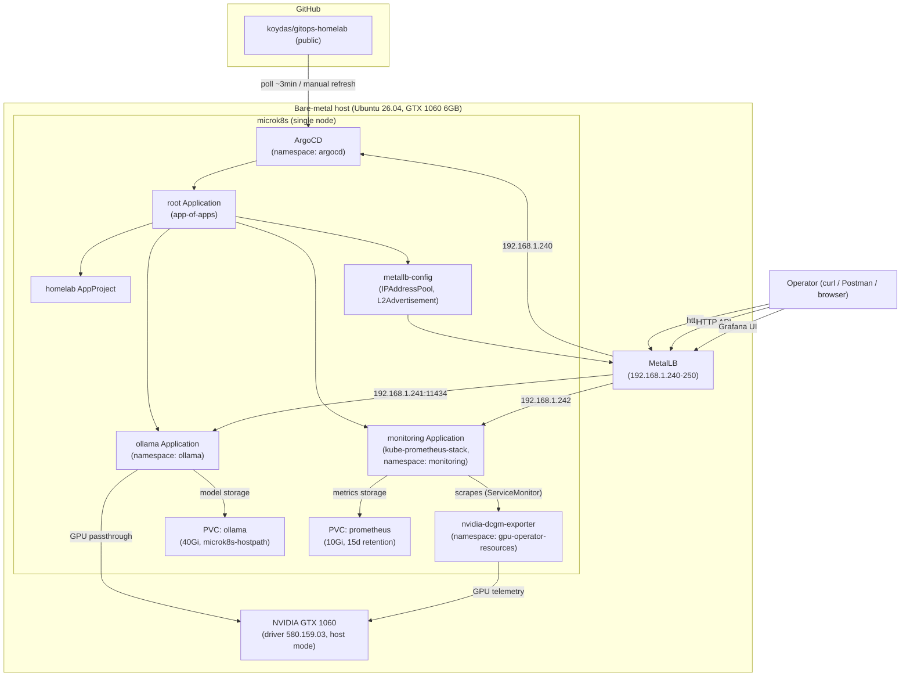

# Architecture

Single-node bare-metal server running microk8s, GitOps-managed by ArgoCD, hosting a local LLM runtime (Ollama) with GPU acceleration.

## Components



## What lives where

| Layer | Source of truth | Notes |
|---|---|---|
| Host OS, NVIDIA driver | Manual (imperative, pre-existing) | Not managed by this repo; assumed present before `bootstrap/install-host.sh` runs |
| microk8s + addons (dns, hostpath-storage, metallb, gpu) + ArgoCD install | `bootstrap/install-host.sh` | Idempotent script, source of truth for host-layer commands |
| ArgoCD `root` Application | `bootstrap/root-app.yaml`, applied once manually | Bootstraps everything below it |
| Workload apps (Ollama, monitoring), AppProject, MetalLB IP pool | `apps/**` in this repo | Fully Git-managed; ArgoCD syncs automatically |
| Ollama model weights | PVC on host disk (`microk8s-hostpath`) | **Not** in Git — re-downloaded on a fresh PVC (see [runbook.md](./runbook.md)) |
| Prometheus metrics (GPU history, etc.) | PVC on host disk (`microk8s-hostpath`, 15d retention) | **Not** in Git — lost if the PVC is deleted; see [ADR-0012](./adr/0012-monitoring-stack.md) |
| ArgoCD admin password | Kubernetes Secret, regenerated per install | Not in Git; rotate after first login |
| Grafana admin password | Kubernetes Secret, auto-generated by the chart on first install | Not in Git; see [runbook.md](./runbook.md) to retrieve it |

## Request flow (Ollama inference)

1. Client (curl, Postman, or the `ollama` CLI pointed at `OLLAMA_HOST`) sends an HTTP request to `192.168.1.241:11434`.
2. MetalLB (L2 mode) routes it to the `ollama` Service, which forwards to the `ollama` Deployment's single pod.
3. The pod has `nvidia.com/gpu: 1` requested and `runtimeClassName: nvidia`, so inference runs on the GTX 1060 rather than falling back to CPU (see [ADR-0003](./adr/0003-ollama-in-cluster.md)).
4. Model weights are read from the PVC (`/root/.ollama`), which persists across pod restarts.

## Monitoring flow (GPU metrics)

1. `nvidia-dcgm-exporter` (deployed by the microk8s `gpu` addon, namespace `gpu-operator-resources`) exposes GPU telemetry (temperature, power, utilization, framebuffer memory) on port 9400.
2. A `ServiceMonitor` (`apps/monitoring/dcgm-servicemonitor.yaml`) tells Prometheus (deployed by the `monitoring` Application's kube-prometheus-stack chart) to scrape it every 30s, across namespaces.
3. Prometheus stores samples on its PVC (`microk8s-hostpath`, 15 day retention — see [ADR-0012](./adr/0012-monitoring-stack.md)).
4. Grafana, provisioned with a Prometheus datasource by the chart and a GPU dashboard (`apps/monitoring/dcgm-dashboard-configmap.yaml`, labeled `grafana_dashboard: "1"` so the chart's sidecar auto-loads it), is reachable at its own MetalLB IP (`192.168.1.242:80`, see [runbook.md](./runbook.md) for login).

## GitOps sync flow (changing what's deployed)

1. Edit a manifest under `apps/` (e.g. bump `models.pull` in `apps/ollama/application.yaml`).
2. Commit and push to `main` on GitHub.
3. ArgoCD's `root` Application polls the repo (~3 min interval; no webhook is possible since there's no public ingress — see [ADR-0002](./adr/0002-lan-only-exposure.md)) and detects drift.
4. `syncPolicy.automated` (with `selfHeal: true`, `prune: true`) applies the change without manual intervention. A hard refresh can be forced with:
   ```bash
   sudo microk8s kubectl -n argocd annotate application <name> argocd.argoproj.io/refresh=hard --overwrite
   ```
