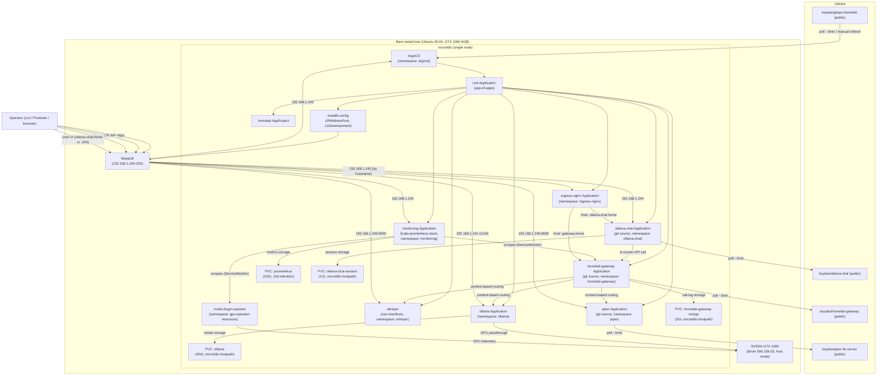

# Architecture

Single-node bare-metal server running microk8s, GitOps-managed by ArgoCD, hosting a local LLM runtime (Ollama) with GPU acceleration.

## Components


```mermaid
flowchart TB
    subgraph gh["GitHub"]
        repo["koydas/gitops-homelab (public)"]
        chatrepo["koydas/ollama-chat (public)"]
        piperrepo["koydas/piper-tts-server (public)"]
        gatewayrepo["koydas/homelab-gateway (public)"]
    end

    subgraph host["Bare-metal host (Ubuntu 26.04, GTX 1060 6GB)"]
        subgraph mk["microk8s (single node)"]
            argocd["ArgoCD\n(namespace: argocd)"]
            root["root Application\n(app-of-apps)"]
            proj["homelab AppProject"]
            ollama["ollama Application\n(namespace: ollama)"]
            mon["monitoring Application\n(kube-prometheus-stack,\nnamespace: monitoring)"]
            ing["ingress-nginx Application\n(namespace: ingress-nginx)"]
            chat["ollama-chat Application\n(git source, namespace: ollama-chat)"]
            whisper["whisper\n(raw manifests, namespace: whisper)"]
            piper["piper Application\n(git source, namespace: piper)"]
            gateway["homelab-gateway Application\n(git source, namespace: homelab-gateway)"]
            dcgm["nvidia-dcgm-exporter\n(namespace: gpu-operator-resources)"]
            mlb["metallb-config\n(IPAddressPool, L2Advertisement)"]
            pvc["PVC: ollama\n(40Gi, microk8s-hostpath)"]
            monpvc["PVC: prometheus\n(10Gi, 15d retention)"]
            chatpvc["PVC: ollama-chat-session\n(1Gi, microk8s-hostpath)"]
            gwpvc["PVC: homelab-gateway-mongo\n(2Gi, microk8s-hostpath)"]
        end
        metallb["MetalLB\n(192.168.1.240-250)"]
        gpu["NVIDIA GTX 1060\n(driver 580.159.03, host mode)"]
    end

    user["Operator (curl / Postman / browser)"]

    repo -- "poll ~3min / manual refresh" --> argocd
    argocd --> root
    root --> proj
    root --> ollama
    root --> mon
    root --> ing
    root --> chat
    root --> whisper
    root --> piper
    root --> gateway
    root --> mlb
    ollama -- "GPU passthrough" --> gpu
    ollama -- "model storage" --> pvc
    mon -- "scrapes (ServiceMonitor)" --> dcgm
    dcgm -- "GPU telemetry" --> gpu
    mon -- "metrics storage" --> monpvc
    chat -- "poll ~3min" --> chatrepo
    chat -- "session storage" --> chatpvc
    chat -- "in-cluster API call" --> gateway
    piper -- "poll ~3min" --> piperrepo
    gateway -- "poll ~3min" --> gatewayrepo
    gateway -- "content-based routing" --> ollama
    gateway -- "content-based routing" --> whisper
    gateway -- "content-based routing" --> piper
    gateway -- "call-log storage" --> gwpvc
    mon -- "scrapes (ServiceMonitor)" --> gateway
    mlb --> metallb
    metallb -- "192.168.1.240" --> argocd
    metallb -- "192.168.1.241:11434" --> ollama
    metallb -- "192.168.1.242" --> mon
    metallb -- "192.168.1.243 (by hostname)" --> ing
    metallb -- "192.168.1.244" --> chat
    metallb -- "192.168.1.245:9000" --> whisper
    metallb -- "192.168.1.246:8000" --> piper
    ing -- "Host: ollama-chat.home" --> chat
    ing -- "Host: gateway.home" --> gateway
    user -- "https" --> metallb
    user -- "HTTP API" --> metallb
    user -- "Grafana UI" --> metallb
    user -- "chat UI (ollama-chat.home or .244)" --> metallb
```

## What lives where

| Layer | Source of truth | Notes |
|---|---|---|
| Host OS, NVIDIA driver | Manual (imperative, pre-existing) | Not managed by this repo; assumed present before `bootstrap/install-host.sh` runs |
| microk8s + addons (dns, hostpath-storage, metallb, gpu) + ArgoCD install | `bootstrap/install-host.sh` | Idempotent script, source of truth for host-layer commands |
| ArgoCD `root` Application | `bootstrap/root-app.yaml`, applied once manually | Bootstraps everything below it |
| Workload apps (Ollama, monitoring, ingress-nginx), AppProject, MetalLB IP pool | `apps/**` in this repo | Fully Git-managed; ArgoCD syncs automatically |
| `ollama-chat` app (Deployment/Service/Ingress/PVC, image build/publish) | `k8s/**` and `.github/workflows/**` in [`koydas/ollama-chat`](https://github.com/koydas/ollama-chat) | First non-Helm, git-source Application — this repo only holds `apps/ollama-chat/application.yaml` pointing at it; see [ADR-0015](./adr/0015-ollama-chat-git-source-application.md) |
| `whisper` app (Deployment/Service, off-the-shelf image) | `apps/whisper/**` in this repo | Raw manifests, no `application.yaml` — picked up by `root`'s recursive directory sync, same pattern as `apps/metallb-config/`; see [ADR-0016](./adr/0016-onboard-whisper-piper-cpu-only.md) |
| `piper` app (Deployment/Service/Dockerfile/CI, custom code) | `k8s/**` and `.github/workflows/**` in [`koydas/piper-tts-server`](https://github.com/koydas/piper-tts-server) | Git-source Application like `ollama-chat`; this repo only holds `apps/piper/application.yaml`; see [ADR-0016](./adr/0016-onboard-whisper-piper-cpu-only.md) |
| `homelab-gateway` app (Deployment/Service/Ingress/ServiceMonitor + bundled MongoDB, custom code) | `k8s/**` and `.github/workflows/**` in [`koydas/homelab-gateway`](https://github.com/koydas/homelab-gateway) | Git-source Application like `ollama-chat`/`piper`; this repo only holds `apps/homelab-gateway/application.yaml`; see [ADR-0020](./adr/0020-onboard-homelab-gateway.md) |
| Ollama model weights | PVC on host disk (`microk8s-hostpath`) | **Not** in Git — re-downloaded on a fresh PVC (see [runbook.md](./runbook.md)) |
| Prometheus metrics (GPU history, etc.) | PVC on host disk (`microk8s-hostpath`, 15d retention) | **Not** in Git — lost if the PVC is deleted; see [ADR-0012](./adr/0012-monitoring-stack.md) |
| `homelab-gateway`'s per-call log (request/response history) | PVC on host disk (`microk8s-hostpath`, 2Gi, 30d TTL), owned by `homelab-gateway`'s own `k8s/mongo.yaml` | **Not** in Git — a rolling audit log, not a system of record; see `homelab-gateway` [ADR-0001](https://github.com/koydas/homelab-gateway/blob/main/docs/adr/0001-mongodb-call-log.md) |
| ArgoCD admin password | Kubernetes Secret, regenerated per install | Not in Git; rotate after first login |
| Grafana admin password | Kubernetes Secret `grafana-admin-credentials`, created once out-of-band (not chart-templated) + PVC-backed SQLite DB (`microk8s-hostpath`, 1Gi) | Not in Git; see [runbook.md](./runbook.md) to retrieve/recreate it. Deliberately not auto-generated by the chart — see [ADR-0012](./adr/0012-monitoring-stack.md) |

## Request flow (Ollama inference)

1. Client (curl, Postman, or the `ollama` CLI pointed at `OLLAMA_HOST`) sends an HTTP request to `192.168.1.241:11434`.
2. MetalLB (L2 mode) routes it to the `ollama` Service, which forwards to the `ollama` Deployment's single pod.
3. The pod has `nvidia.com/gpu: 1` requested and `runtimeClassName: nvidia`, so inference runs on the GTX 1060 rather than falling back to CPU (see [ADR-0003](./adr/0003-ollama-in-cluster.md)).
4. Model weights are read from the PVC (`/root/.ollama`), which persists across pod restarts.

## Request flow (via homelab-gateway)

`ollama-chat`'s production backend (chat, STT, and TTS calls alike) no longer talks to
Ollama/Whisper/Piper directly — it's proxied through `homelab-gateway`, the unified LAN entry
point onboarded in [ADR-0020](./adr/0020-onboard-homelab-gateway.md) and rerouted into by
`ollama-chat`'s own [ADR-0014](https://github.com/koydas/ollama-chat/blob/main/docs/adr/0014-route-production-traffic-through-homelab-gateway.md).

1. `ollama-chat`'s Express backend sends its `OLLAMA_URL`/`WHISPER_URL`/`PIPER_URL` calls to
   `homelab-gateway.homelab-gateway.svc.cluster.local:80` instead of each backend's own
   Service.
2. `homelab-gateway` picks the right backend by sniffing `Content-Type` and JSON body shape
   (audio/multipart → Whisper `/asr`, JSON `text` field → Piper `/tts`, JSON `model` field or
   bodiless → Ollama, path preserved) — see that repo's README for the full rule set.
3. Every proxied call is recorded as a Prometheus metric (`gateway_http_requests_total`,
   `gateway_ollama_model_requests_total{model}`, scraped by the `monitoring` Application) and
   as a MongoDB document with the full request/response (`homelab-gateway`
   [ADR-0001](https://github.com/koydas/homelab-gateway/blob/main/docs/adr/0001-mongodb-call-log.md),
   stored on the `homelab-gateway-mongo` PVC).
4. `homelab-gateway` itself is reached via `ingress-nginx` at `gateway.home`
   (`192.168.1.243`), the same pattern as `ollama-chat.home`.

## Request flow (voice mode: STT/TTS)

1. The browser records a message (or gets a reply to speak) and calls `ollama-chat`'s
   Express backend at `/api/stt` or `/api/tts` (same MetalLB IP/Ingress as the chat UI
   itself, `192.168.1.244` / `ollama-chat.home`).
2. Express proxies the request to `homelab-gateway` (see above), which routes it in-cluster
   via Service DNS: `/asr` → `whisper.whisper.svc.cluster.local:9000`
   (`onerahmet/openai-whisper-asr-webservice`), `/tts` →
   `piper.piper.svc.cluster.local:8000` (the custom `piper-tts-server`) — no Express-side
   body parsing on either hop, both are pure byte-stream proxies, mirroring how it already
   talks to Ollama.
3. Both Whisper and Piper run CPU-only (see [ADR-0016](./adr/0016-onboard-whisper-piper-cpu-only.md))
   — the GTX 1060 stays dedicated to Ollama.
4. Each also has its own LoadBalancer IP (`192.168.1.245` Whisper, `192.168.1.246` Piper) so
   `ollama-chat`'s local Vite dev server can reach them directly, without going through
   `homelab-gateway` or the Express backend at all — same as local dev already reaches Ollama
   directly at `192.168.1.241`, bypassing the gateway too.

## Monitoring flow (GPU metrics)

1. `nvidia-dcgm-exporter` (deployed by the microk8s `gpu` addon, namespace `gpu-operator-resources`) exposes GPU telemetry (temperature, power, utilization, framebuffer memory) on port 9400.
2. A `ServiceMonitor` (`apps/monitoring/dcgm-servicemonitor.yaml`) tells Prometheus (deployed by the `monitoring` Application's kube-prometheus-stack chart) to scrape it every 30s, across namespaces.
3. Prometheus stores samples on its PVC (`microk8s-hostpath`, 15 day retention — see [ADR-0012](./adr/0012-monitoring-stack.md)).
4. Grafana, provisioned with a Prometheus datasource by the chart and a GPU dashboard (`apps/monitoring/dcgm-dashboard-configmap.yaml`, labeled `grafana_dashboard: "1"` so the chart's sidecar auto-loads it), is reachable at its own MetalLB IP (`192.168.1.242:80`, see [runbook.md](./runbook.md) for login).

## Ingress flow (host-routed apps)

1. `ingress-nginx` (`apps/ingress-nginx/application.yaml`) is the one `IngressClass` for the cluster (`ingressClassResource.default: true`), reachable at a pinned MetalLB IP (`192.168.1.243`, see [ADR-0014](./adr/0014-ingress-nginx-controller.md)).
2. A future HTTP app adds its own `Ingress` object naming a hostname; no client-facing MetalLB IP of its own is needed. `ollama-chat` (ADR-0015) is the first: its `Ingress` lives in its own repo's `k8s/` dir, not under `apps/` here, since it's a git-source Application rather than a Helm chart — see ADR-0015.
3. The operator's device resolves that hostname (e.g. `ollama-chat.home`) to `.243` (`/etc/hosts` entry or LAN DNS — no DNS server exists in this environment yet), and ingress-nginx routes by `Host` header to the right Service.
4. Still LAN-only: no public domain, no cert-manager/TLS — see [ADR-0002](./adr/0002-lan-only-exposure.md), amended by ADR-0014 only for the internal routing model, not the exposure boundary.

## GitOps sync flow (changing what's deployed)

1. Edit a manifest under `apps/` (e.g. bump `models.pull` in `apps/ollama/application.yaml`).
2. Commit and push to `main` on GitHub.
3. ArgoCD's `root` Application polls the repo (~3 min interval; no webhook is possible since there's no public ingress — see [ADR-0002](./adr/0002-lan-only-exposure.md)) and detects drift.
4. `syncPolicy.automated` (with `selfHeal: true`, `prune: true`) applies the change without manual intervention. A hard refresh can be forced with:
   ```bash
   sudo microk8s kubectl -n argocd annotate application <name> argocd.argoproj.io/refresh=hard --overwrite
   ```
